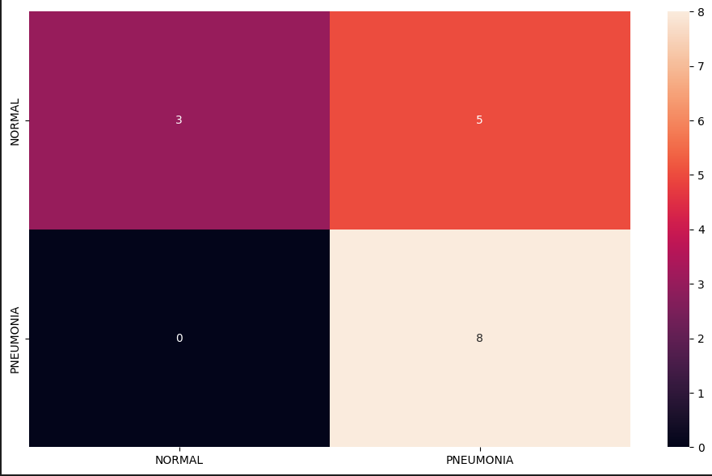

# CNN_Predict_Pneumonia

# Detecção de Pneumonia em Raios-X com CNN em PyTorch

## 📌 Visão Geral
Projeto de deep learning utilizando PyTorch para classificação automática de pneumonia em imagens de radiografia torácica. O modelo CNN foi desenvolvido para auxiliar no diagnóstico médico, classificando imagens como "Normal" ou "Pneumonia".

## 🗃️ Conjunto de Dados
A base de dados utilizada foi [Chest X-Ray Images (Pneumonia) dataset](https://www.kaggle.com/paultimothymooney/chest-xray-pneumonia) do Kaggle contendo:

- **5,800 imagens** (treino/validação/teste)

## 🏗️ Estrutura do Projeto
CNN_PNEUMONIA/
├── imgs/
├── Notebook/
│ ├── CNNtoIdentifyPneumonia.ipynb
└── README.md

📊 Resultados
Métrica	Valor
Acurácia	69.0%

## Proximos Passos
-Explorar novas arquiteturas de redes neurais convolucionais
-Aplicar tecnicas de Data Augmentation para criar uma diversidade nos dados
-Explorar novas tecnicas

## Aviso 
Este projeto foi criado com o intuito de entender melhor a ferramenta Pytorch, e sobre a criação e utilização de CNNs
